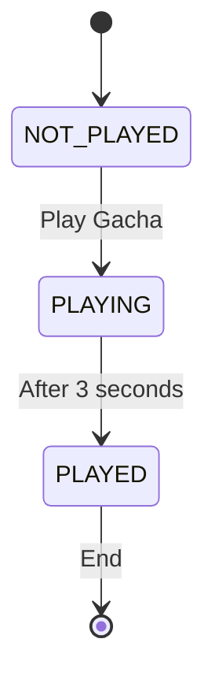

- [Developing](#developing)
  - [Building](#building)
  - [Setup](#setup)
    - [Stamps](#stamps)
      - [Database Schema](#database-schema)
      - [Setup Process](#setup-process)
      - [Security Model](#security-model)
  - [Events](#events)
  - [Gacha game](#gacha-game)
    - [State diagram](#state-diagram)

# Developing

Once you've created a project and installed dependencies with `npm install` (or `pnpm install` or `yarn`), start a development server:

```bash
npm run dev

# or start the server and open the app in a new browser tab
npm run dev -- --open
```

The app will always try to establish a connection to the server at `socketServerURL` (check in `const.ts`).

For regular HTTP API requests, the app will use the `apiServerURL` (check in `const.ts`).

You can configure the production build server URLs in the same module.

## Building

To create a production version of your app:

```bash
pnpm run build
```

You can preview the production build with `pnpm run preview`.

> To deploy your app, you may need to install an [adapter](https://kit.svelte.dev/docs/adapters) for your target environment.

## Setup

### Stamps

Stamps are the collectible items in the stamp rally system. Each stamp represents an artist or booth at an event and contains the following data:

#### Database Schema

- `name`: Artist/booth name
- `hash`: SHA-256 hash of the secret token (used for verification)
- `description`: Social media link or description
- `external_url`: Link to external resources (partner homepage, convention app, etc.)
- `event_id`: Foreign key linking to the event
- `nsfw`: Boolean flag for adult content
- `booth_id`: Physical booth location identifier
- `is_visible`: Boolean flag to control stamp visibility

#### Setup Process

1. **Prepare stamp data**: Create a CSV file with stamp information (see `2025.csv` as example)

2. **Generate tokens and hashes**: 
   ```bash
   # Create a script to generate random tokens and SHA-256 hashes
   node generate_tokens.js
   ```
   This creates:
   - `artist_tokens.txt`: Secret tokens for QR code generation
   - `updated.csv`: CSV with real hash values

3. **Create migration**: Use Supabase CLI to create and apply migrations
   ```bash
   supabase migration new upsert_stamps
   supabase db push
   ```

4. **Token distribution**: 
   - Generate QR codes from the secret tokens in `artist_tokens.txt`
   - Distribute QR codes to artists/booths
   - Users scan QR codes to collect stamps

#### Security Model

- **Secret tokens**: Only known to the system and distributed via QR codes
- **Hash storage**: Only SHA-256 hashes are stored in the database
- **Verification**: When users scan a QR code, the token is hashed and compared against stored hashes
- **No reverse engineering**: Hashes cannot be used to derive original tokens

The `external_url` field is a generic link to external resources (partner homepage, convention app deep links, etc.).

## Events

Events are managed in Supabase. Each event has an `id`. This ID is later used in a link to holoquest so the app knows which event to load.

E.g. if the event ID is `1`, the link to the event in holoquest is `https://app.holoquest.app/?eventId=1`.

This will fetch and store the data for that event locally.

If there is no event data locally and it's ID is not supplied as a parameter, the app will fetch the events from Supabase and display them in a list.

## Gacha game

On the completion of the stamp rally, a one time gacha game pull is available.

### State diagram



The wait time for the pull result is configurable in the `HolomemGacha` component, as well as any extra logic you want to add to the game.
