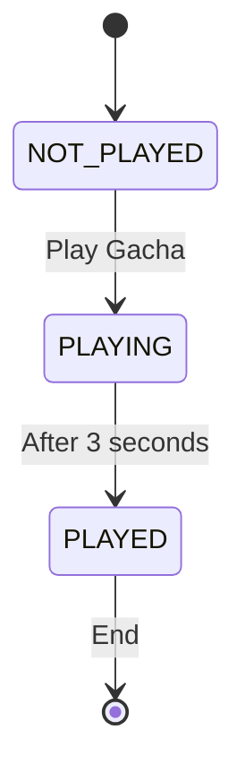

- [Developing](#developing)
  - [Building](#building)
  - [Setup](#setup)
    - [Stamps](#stamps)
  - [Events](#events)
  - [Gacha game](#gacha-game)
    - [State diagram](#state-diagram)

# Developing

Once you've created a project and installed dependencies with `npm install` (or `pnpm install` or `yarn`), start a development server:

```bash
npm run dev

# or start the server and open the app in a new browser tab
npm run dev -- --open
```

The app will always try to establish a connection to the server at `socketServerURL` (check in `const.ts`).

For regular HTTP API requests, the app will use the `apiServerURL` (check in `const.ts`).

You can configure the production build server URLs in the same module.

## Building

To create a production version of your app:

```bash
pnpm run build
```

You can preview the production build with `pnpm run preview`.

> To deploy your app, you may need to install an [adapter](https://kit.svelte.dev/docs/adapters) for your target environment.

## Setup

### Stamps

WIP

The `externalURL` is a generic link to some external URL (this might be a link to a partner's homepage, a deep link in a convention's app etc.).

## Events

Events are managed in Supabase. Each event has an `id`. This ID is later used in a link to holoquest so the app knows which event to load.

E.g. if the event ID is `1`, the link to the event in holoquest is `https://app.holoquest.app/?eventId=1`.

This will fetch and store the data for that event locally.

If there is no event data locally and it's ID is not supplied as a parameter, the app will fetch the events from Supabase and display them in a list.

## Gacha game

On the completion of the stamp rally, a one time gacha game pull is available.

### State diagram



The wait time for the pull result is configurable in the `HolomemGacha` component, as well as any extra logic you want to add to the game.
