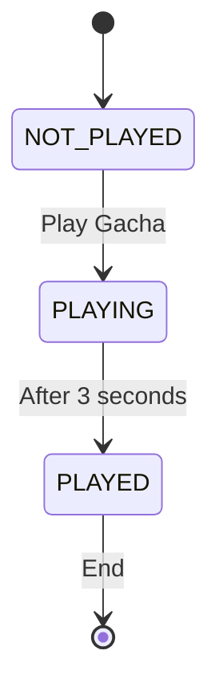

- [Developing](#developing)
	- [Building](#building)
	- [Setup](#setup)
		- [Stamps](#stamps)
		- [Server](#server)
	- [Events](#events)
	- [Gacha game](#gacha-game)
		- [State diagram](#state-diagram)

# Developing

Once you've created a project and installed dependencies with `npm install` (or `pnpm install` or `yarn`), start a development server:

```bash
npm run dev

# or start the server and open the app in a new browser tab
npm run dev -- --open
```

The app will always try to establish a connection to the server at `socketServerURL` (check in `const.ts`).

For regular HTTP API requests, the app will use the `apiServerURL` (check in `const.ts`).

You can configure the production build server URLs in the same module.

## Building

To create a production version of your app:

```bash
pnpm run build
```

You can preview the production build with `pnpm run preview`.

> To deploy your app, you may need to install an [adapter](https://kit.svelte.dev/docs/adapters) for your target environment.

## Setup

### Stamps

The way the quest works, is that the app has a hardcoded array of stamps `expectedStamps` to be collected in `const.ts`. Those stamps are then displayed in the root view.

Each Stamp in the real world is a **UUID token** encoded as a **QR code**. The expected stamps contain the **SHA1 hashes** of the UUIDs, so that the app can verify that the scanned stamp is the correct one.

If you want stamps to have an image, add the optimized asset to `src/lib/assets` and reference it using a SvelteKit import.

For example, a stamp might look like this:

```javascript
{
		hash: '37d895725ad8aa8bba87a139710e909b46cb753e',
		id: 1,
		name: 'Hasuke はすけ 4C16',
		description: `
		Digital Artist & V-Tuber | 🇩🇪🇺🇸🇯🇵 |
| Graphic Art | Illustration | Gamedev |
Certified Hololive Simp
Modell & Banner by me.`,
		externalURL: 'https://webapp.dokomi.de/explore/c/108511',
		imageURL: hasukeProfilePic
	},
```

And you import the image like this:

```javascript
import hasukeProfilePic from '$lib/assets/hasuke-profile.png';
```

The `externalURL` is a generic link to some external URL (this might be a link to a partner's homepage, a deep link in a convention's app etc.).

### Server

The server implementation and documentation is available [HERE](https://github.com/watsonindustries/tako).

## Events

WIP

## Gacha game

On the completion of the stamp rally, a one time gacha game pull is available.

### State diagram



The wait time for the pull result is configurable in the `HolomemGacha` component, as well as any extra logic you want to add to the game.
